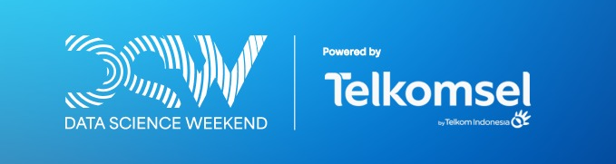

  

# RFM-and-Kmeans-for-Customer-Segmentation-Project
## About
This project was undertaken as part of the Data Science Weekend challenge hosted by Telkomsel. The event took place at the Telkomsel Smart Office in Jakarta in November 2023.

## Methods
We are employing RFM analysis and K-means clustering techniques to construct a dashboard, utilizing the dataset furnished by the company.

